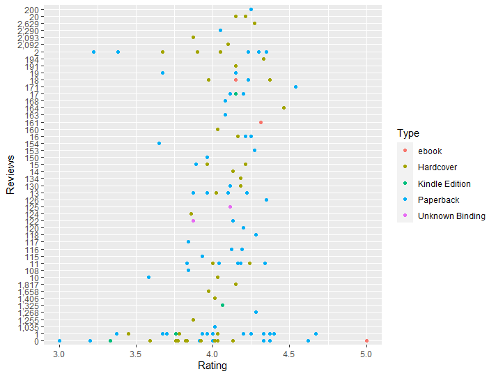
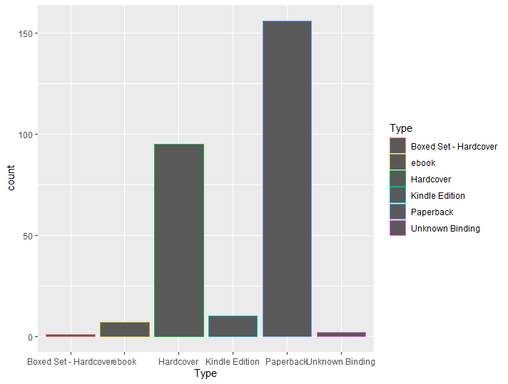

# R-Assignment 4

**Created by Kanphong Srisutapat (ID: 63130500004)**

Choose Dataset:
1. Top 270 Computer Science / Programing Books (Data from Thomas Konstantin, [Kaggle](https://www.kaggle.com/thomaskonstantin/top-270-rated-computer-science-programing-books)) >> [Using CSV](https://raw.githubusercontent.com/safesit23/INT214-Statistics/main/datasets/prog_book.csv)

2. Superstore Sales Dataset (Data from Rohit Sahoo,[Kaggle](https://www.kaggle.com/rohitsahoo/sales-forecasting)) >> [Using CSV](https://raw.githubusercontent.com/safesit23/INT214-Statistics/main/datasets/superstore_sales.csv)


### Outlines
1. Explore the dataset
2. Learning function from Tidyverse
3. Transform data with dplyr and finding insight the data
4. Visualization with GGplot2

## Part 1: Explore the dataset

```
library(dplyr)
library(readr)

book <- read.csv("https://raw.githubusercontent.com/safesit23/INT214-Statistics/main/datasets/prog_book.csv")
```
In this dataset has

```
Rows: 271
Columns: 7
$ Rating          <dbl> 4.17, 4.01, 3.33, 3.97, 4.06, 3.84, 4.09, 4.15, 3.87, 4.62, 4.03, 3.78, 3.73, 3.87, 3.87, 3.95, 3.85, 3.94, 3.75, ~
$ Reviews         <chr> "3,829", "1,406", "0", "1,658", "1,325", "117", "5,938", "1,817", "2,093", "0", "160", "481", "33", "1,255", "593"~
$ Book_title      <chr> "The Elements of Style", "The Information: A History, a Theory, a Flood", "Responsive Web Design Overview For Begi~
$ Description     <chr> "This style manual offers practical advice on improving writing skills. Throughout, the emphasis is on promoting a~
$ Number_Of_Pages <int> 105, 527, 50, 393, 305, 288, 256, 368, 259, 128, 352, 352, 200, 328, 240, 288, 392, 304, 336, 542, 192, 242, 224, ~
$ Type            <chr> "Hardcover", "Hardcover", "Kindle Edition", "Hardcover", "Kindle Edition", "Paperback", "Hardcover", "Hardcover", ~
$ Price           <dbl> 9.323529, 11.000000, 11.267647, 12.873529, 13.164706, 14.188235, 14.232353, 14.364706, 14.502941, 14.641176, 15.22~
```
1.เช็คว่ามีค่า null ในตัว dataset ไหม

```
is.na(book)
```
ไม่มีข้อมูลใน dataset ที่เป็น null

2.สำรวจข้อมูลเบื้องต้น

```
summary(book)
```

```
     Rating        Reviews           Book_title        Description        Number_Of_Pages      Type               Price        
 Min.   :3.000   Length:271         Length:271         Length:271         Min.   :  50.0   Length:271         Min.   :  9.324  
 1st Qu.:3.915   Class :character   Class :character   Class :character   1st Qu.: 289.0   Class :character   1st Qu.: 30.751  
 Median :4.100   Mode  :character   Mode  :character   Mode  :character   Median : 384.0   Mode  :character   Median : 46.318  
 Mean   :4.067                                                            Mean   : 475.1                      Mean   : 54.542  
 3rd Qu.:4.250                                                            3rd Qu.: 572.5                      3rd Qu.: 67.854  
 Max.   :5.000                                                            Max.   :3168.0                      Max.   :235.650  
 ```

## Part 2: Learning function from Tidyverse

- Function `select()` from package [dplyr](https://dplyr.tidyverse.org/articles/dplyr.html#select-columns-with-select)). It using for select columns

```
starwars %>% select(name,height)
```
** You can sepearate this part or combine in part of `Transform data with dplyr and finding insight the data`

## Part 3: Transform data with dplyr and finding insight the data

1.ชื่อหนังสือที่มียอดรีวิวมกกว่าเท่ากับ 600 แต่ไม่เกิน 1000ไม่เกิน1000

```
book %>%
  filter(Reviews >= 600,Reviews < 1000) %>%
  select(Reviews,Book_title) %>%
  arrange(Book_title)

```

Result: แสดงชื่อหนังสือและยอดรีวิวที่มียอดรีวิวตั้งแต่ 600 ถึง 1000

```
  Reviews                                                              Book_title
1     676 Big Data: A Revolution That Will Transform How We Live, Work, and Think
2     875                  Clean Code: A Handbook of Agile Software Craftsmanship
3     746                  The Mythical Man-Month: Essays on Software Engineering
```


## Part 4: Visualization with GGplot2
### 1.) Graph show relation between height and mass
```
# Graph relation between Rating and Reviews
 scat_plot0 <- book %>% 
 filter(Reviews <= 2000 ) %>% 
 ggplot(aes(x=Rating,y=Reviews)) + geom_point(aes(color=Type))
 scat_plot0
 
 # แผนภูมิเเท่งเเสดงจำนวนของ type 
 bar <- book %>% 
 ggplot(aes(x=Type)) + geom_bar(aes(color=Type))
 bar
```
Result:





